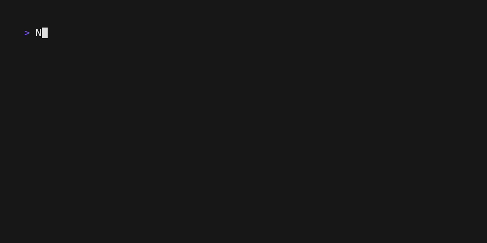

# Voy

Three-pane TUI file manager built with Bun + Ink (React for CLI).

The layout is inspired by [Yazi](https://github.com/sxyazi/yazi), but the keybindings and behavior follow Vim conventions. If you're familiar with Yazi, note that the key mappings are **not** the same — Voy uses its own Vim-oriented bindings.



## Features

- **Three-pane layout** — Parent / Current / Preview columns
- **Vim-style navigation** — `hjkl`, `gg`/`G`, `H`/`M`/`L`, `Ctrl+d`/`Ctrl+u`/`Ctrl+f`/`Ctrl+b`, numeric prefix (`5j`)
- **File operations** — Copy (`yy`), Cut (`x`), Delete (`dd`/`D`), Paste (`pp`), Rename (`r`), Create (`o`/`O`)
- **Visual selection** — `Space` toggle, `v` visual mode, `V` select all
- **Search** — `/` incremental search, `n`/`N` jump between matches
- **Command mode** — `:q`, `:cd`, `:mkdir`, `:touch`
- **Preview** — Syntax highlighting (shiki), directory listings, binary detection
- **Preview mode** — Vim normal-style cursor movement, line selection, copy to clipboard
- **Directory history** — `Ctrl+o` to jump back, `~` to go home
- **Hidden files** — `.` to toggle visibility
- **Virtual scrolling** — Handles large directories efficiently
- **Color coding** — File type based coloring (30+ extensions)

## Requirements

- [Bun](https://bun.sh/) v1.0+

## Getting Started

```bash
# Install dependencies
bun install

# Run
bun run src/index.tsx

# Or with a specific directory
bun run src/index.tsx /path/to/dir
```

## Keybindings

### Normal Mode — Navigation

| Key | Action |
|-----|--------|
| `j` / `↓` | Move cursor down |
| `k` / `↑` | Move cursor up |
| `l` / `→` / `Enter` | Enter directory / open preview |
| `h` / `←` / `-` | Parent directory |
| `gg` | Go to first entry |
| `G` | Go to last entry |
| `H` | Jump to top of screen |
| `M` | Jump to middle of screen |
| `L` | Jump to bottom of screen |
| `Ctrl+d` | Half page down |
| `Ctrl+u` | Half page up |
| `Ctrl+f` | Full page down |
| `Ctrl+b` | Full page up |
| `~` | Go to home directory |
| `Ctrl+o` | Go back (directory history) |

### Normal Mode — File Operations

| Key | Action |
|-----|--------|
| `yy` | Yank (copy) file(s) |
| `x` | Cut file(s) (move via `pp`) |
| `dd` / `D` | Delete file(s) (with confirmation) |
| `pp` | Paste file(s) |
| `r` | Rename |
| `o` | Create new file |
| `O` | Create new directory |
| `e` | Open in `$EDITOR` |
| `W` | Open with system default app |
| `Space` | Toggle selection |
| `v` | Visual selection mode |
| `V` | Select / deselect all |

### Normal Mode — Other

| Key | Action |
|-----|--------|
| `P` | Enter preview mode |
| `/` | Search mode |
| `n` / `N` | Next / previous match |
| `:` | Command mode |
| `.` | Toggle hidden files |
| `q` | Quit |

### Preview Mode

Enter with `P` or `l` on a text file. The preview pane gets a Vim normal-style cursor.

| Key | Action |
|-----|--------|
| `j` / `k` / `↑` / `↓` | Move cursor |
| `gg` / `G` | Go to first / last line |
| `Ctrl+d` / `Ctrl+u` | Half page down / up |
| `Space` | Toggle line selection |
| `v` | Visual line selection |
| `V` | Select / deselect all lines |
| `y` | Copy selected lines to system clipboard |
| `e` | Open in `$EDITOR` at cursor line |
| `q` / `Esc` | Exit preview mode |

### Visual Mode

Enter with `v` in normal mode.

| Key | Action |
|-----|--------|
| `j` / `k` | Extend selection |
| `v` | Confirm selection |
| `Esc` | Cancel selection |

### Commands

| Command | Action |
|---------|--------|
| `:q` | Quit |
| `:cd <path>` | Change directory |
| `:mkdir <name>` | Create directory |
| `:touch <name>` | Create file |

## Tech Stack

- **Runtime**: Bun
- **UI**: Ink 6 (React 19)
- **Fullscreen**: fullscreen-ink
- **Syntax Highlighting**: shiki (VS Code quality)
- **Language**: TypeScript (strict mode)

## Testing

```bash
bun test
```

## License

MIT
